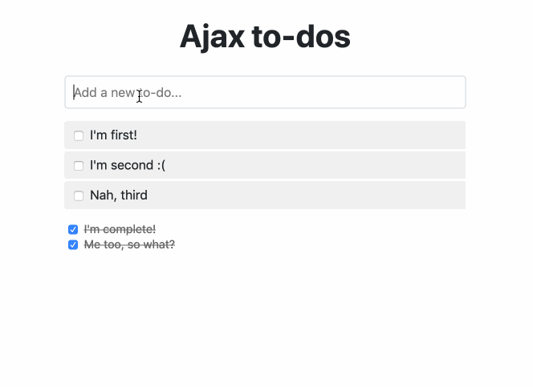

# Ajax To-dos

A simple to-do list application created with [Hotwire](https://hotwire.dev/) and Ruby on Rails.



> Note: This app was originally created with SJR (Server-generated JavaScript Responses) which are kind of old predecessors of Hotwire. You can find the SJR version in the [sjr](https://github.com/mrhead/todos/tree/server-generated-javascript-responses) branch. R.I.P. SJR.

## Installation

Clone the repository:

```
git clone git@github.com:mrhead/todos.git
```

Setup the application:

```
cd todos
./bin/setup
```

Start the webserver:

```
bundle exec rails s
```

Go to http://localhost:3000/.

## Testing

Run:

```
rails test
rails test:system
```
